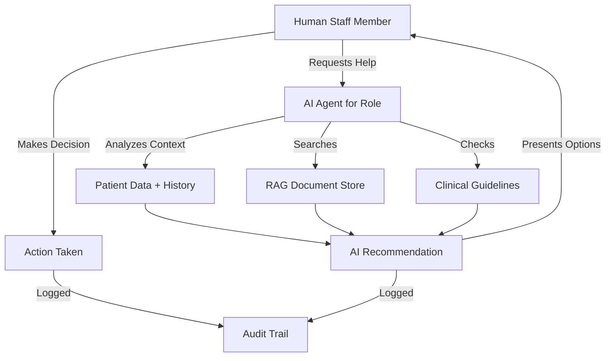
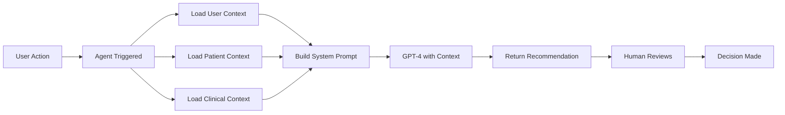

# Role-Based AI Agent Architecture Plan
## Human-AI Collaboration Framework for Medical Staff

**Current Status**: Base infrastructure exists, 10 agents defined in database, real GPT-4 connected  
**Goal**: Create context-aware AI agents that augment each staff role

---

## 🧠 CURRENT STATE ANALYSIS

### Agents Defined (from migration 002)
**Role-Based Agents** (6):
1. **Pharmacist Agent** - Prescription verification, drug interactions
2. **Physician Agent** - Prescription authorization, clinical decisions
3. **Administrative Agent** - Scheduling, document processing
4. **Nurse Agent** - Care coordination, follow-ups
5. **Billing Agent** - Insurance claims, billing
6. **Compliance Agent** - Regulatory compliance, audits

**Encoding Agents** (4):
7. **Letter Encoding Agent** - Extract data from letters
8. **Referral Encoding Agent** - Process referral documents
9. **Communication Encoding Agent** - Categorize communications
10. **Document Encoding Agent** - General document extraction

### What Exists
✅ Database schema for AI agents  
✅ Base agent class with real GPT-4 integration  
✅ Agent registry for managing agents  
✅ System prompts defined  
✅ OpenAI client with token tracking  
✅ RAG service for document search

### What's Missing
❌ Concrete agent implementations  
❌ Tools/capabilities for each agent  
❌ UI integration points  
❌ Human-AI collaboration workflows  
❌ Context injection mechanisms  
❌ Agent-to-agent communication

---

## 🎯 ARCHITECTURAL VISION

### Human-AI Collaboration Model



### Context Flow for AI Agents



---

## 📋 IMPLEMENTATION PLAN

### 1. Create Concrete Agent Implementations

**Physician AI Agent** (`src/lib/ai/agents/physician-agent.ts`):
```typescript
class PhysicianAgent extends BaseAgent {
  // Context: Patient medical history, current medications, allergies
  // Capabilities: Review cases, suggest diagnoses, recommend treatments
  // Tools: Search medical literature, check drug interactions, review guidelines
  
  async process(input: string, context: AgentContext): Promise<AgentMessage> {
    const systemPrompt = this.buildContextualPrompt(context)
    const patientData = await this.loadPatientContext(context.patientId)
    const relevantDocs = await RAGService.getRelevantContext(input)
    
    return await this.callLLM([
      { role: 'system', content: systemPrompt },
      { role: 'system', content: `Patient Context: ${JSON.stringify(patientData)}` },
      { role: 'system', content: `Clinical Guidelines: ${relevantDocs}` },
      { role: 'user', content: input }
    ])
  }
  
  private buildContextualPrompt(context: AgentContext): string {
    return `You are a licensed physician AI assistant working in a sleep clinic.
    
CURRENT CONTEXT:
- You are assisting with patient ${context.patientId || 'unknown'}
- Current task: ${context.metadata?.task || 'general consultation'}
- Clinic focus: Sleep disorders, CPAP therapy, PFT testing

YOUR ROLE:
- Review patient cases and medical history
- Suggest diagnoses based on symptoms and test results
- Recommend appropriate treatments (CPAP, medication, lifestyle changes)
- Ensure adherence to clinical guidelines
- Flag potential safety issues or contraindications

REMEMBER:
- You are an ASSISTANT - final decisions are made by human physicians
- Always cite clinical evidence when making recommendations
- Prioritize patient safety above all else
- Be concise but thorough in your recommendations`
  }
}
```

**Nurse AI Agent** (`src/lib/ai/agents/nurse-agent.ts`):
```typescript
class NurseAgent extends BaseAgent {
  // Context: Patient care plans, follow-up schedules, vital signs
  // Capabilities: Schedule follow-ups, patient education, care coordination
  // Tools: Review care plans, check medication schedules, assess vitals
  
  private buildContextualPrompt(context: AgentContext): string {
    return `You are a registered nurse AI assistant in a sleep clinic.

CURRENT CONTEXT:
- Patient: ${context.patientId || 'unknown'}
- Task: ${context.metadata?.task || 'general care'}

YOUR ROLE:
- Coordinate patient care and follow-ups
- Provide patient education on CPAP use, sleep hygiene
- Monitor CPAP compliance data
- Schedule necessary follow-up appointments
- Assess patient needs and concerns

COLLABORATION:
- Work alongside human nurses
- Provide recommendations, not directives
- Flag urgent issues for immediate human review
- Document all interactions for continuity of care`
  }
}
```

**Administrative AI Agent** (`src/lib/ai/agents/admin-agent.ts`):
```typescript
class AdminAgent extends BaseAgent {
  // Context: Appointment schedules, insurance information, documents
  // Capabilities: Schedule optimization, insurance verification, document processing
  // Tools: Check availability, verify insurance, process forms
  
  private buildContextualPrompt(context: AgentContext): string {
    return `You are an administrative AI assistant in a medical sleep clinic.

CURRENT CONTEXT:
- User: ${context.userId || 'unknown'}
- Task: ${context.metadata?.task || 'general admin'}

YOUR CAPABILITIES:
- Find optimal appointment times using AI scheduling
- Verify insurance coverage and benefits
- Process and categorize incoming documents
- Generate and send appointment reminders
- Coordinate between departments

WORKFLOW OPTIMIZATION:
- Maximize staff utilization (target: 85%)
- Minimize scheduling gaps
- Prioritize urgent appointments
- Ensure smooth patient flow`
  }
}
```

### 2. Agent Integration Points in UI

**Where Each Agent Appears**:

**Physician Agent**:
- Patient chart review page (suggest diagnoses)
- Prescription creation (verify appropriateness)
- Sleep study interpretation (assist with diagnosis)
- Treatment planning (recommend CPAP vs other options)

**Nurse Agent**:
- Patient care page (suggest follow-ups)
- CPAP training (provide education tips)
- Compliance monitoring (identify non-compliant patients)
- Patient communication (draft messages)

**Administrative Agent**:
- Scheduling page (AI recommendations - DONE!)
- Insurance verification (auto-verify coverage)
- Document upload (auto-categorize and extract data)
- Appointment reminders (draft personalized messages)

**Billing Agent**:
- Invoice creation (suggest proper codes)
- Insurance claim (verify completeness)
- Payment posting (flag discrepancies)
- AR management (recommend collection actions)

**Pharmacist Agent**:
- Prescription review (check interactions)
- Medication counseling (provide patient info)
- Dosage verification (validate appropriateness)

**Compliance Agent**:
- Audit page (identify compliance gaps)
- Documentation review (ensure completeness)
- Regulatory monitoring (flag potential issues)

### 3. Context Injection System

**What Context Each Agent Needs**:

```typescript
interface AgentContextBuilder {
  // Core context
  userId: string
  userRole: UserRole
  
  // Patient context (if applicable)
  patientId?: string
  patientAge?: number
  patientAllergies?: string[]
  patientMedications?: Medication[]
  patientDiagnoses?: Diagnosis[]
  
  // Clinical context
  recentEncounters?: Encounter[]
  activePrescrip
tions?: Prescription[]
  sleepStudyResults?: SleepStudy[]
  pftResults?: PFTTest[]
  
  // Operational context
  currentAppointments?: Appointment[]
  staffCapacity?: StaffCapacity
  pendingTasks?: Task[]
  
  // Organizational context
  clinicPolicies?: string[]
  clinicalGuidelines?: string[]
  insurancePolicies?: InsurancePolicy[]
}
```

### 4. Agent Invocation Workflows

**Pattern 1: Inline Assistant (Real-time Help)**
```
User working on task → Clicks "Ask AI" button → Agent analyzes context → 
Provides suggestion → User reviews → User makes decision
```

**Pattern 2: Background Processing (Automated)**
```
Document uploaded → Encoding agent triggered → Extracts data → 
Populates fields → Human reviews → Approves or edits
```

**Pattern 3: Proactive Alerts**
```
System detects condition → Agent evaluates severity → 
Generates recommendation → Notifies human → Human takes action
```

**Pattern 4: Collaborative Review**
```
Human drafts prescription → Pharmacist agent reviews → 
Flags potential issues → Suggests alternatives → Human adjusts
```

### 5. UI Components Needed

**Agent Chat Widget** (Right sidebar):
- Appears on any page
- Context-aware (knows what page user is on)
- Shows relevant agent for current task
- Quick suggestions based on context

**Agent Recommendation Cards**:
- Inline suggestions within workflows
- Show AI confidence level
- Explain reasoning
- Easy to accept/reject

**Agent Activity Feed**:
- Show what agents have done
- Audit trail of AI recommendations
- Human decisions made

---

## 🔧 IMPLEMENTATION TASKS

1. **Create Concrete Agent Classes**
   - Implement PhysicianAgent extends BaseAgent
   - Implement NurseAgent extends BaseAgent
   - Implement AdminAgent extends BaseAgent
   - Implement BillingAgent extends BaseAgent
   - Implement PharmacistAgent extends BaseAgent
   - Implement ComplianceAgent extends BaseAgent

2. **Build Context Loaders**
   - Create PatientContextLoader service
   - Create ClinicalContextLoader service
   - Create OperationalContextLoader service
   - Integrate RAG for relevant documents

3. **Create UI Integration Components**
   - AgentChatWidget component (sidebar)
   - AgentRecommendationCard component
   - AgentActivityFeed component
   - AgentSuggestionBadge component

4. **Define Agent Tools**
   - SearchMedicalLiterature tool
   - CheckDrugInteractions tool
   - VerifyInsurance tool
   - FindOptimalSlot tool
   - GenerateDocument tool

5. **Implement Collaboration Patterns**
   - Inline agent assistance on forms
   - Proactive agent alerts
   - Background agent processing
   - Multi-agent consultation for complex cases

---

## 💡 BEST PRACTICES FOR HUMAN-AI COLLABORATION

### Principles
1. **AI Suggests, Human Decides** - Never auto-execute critical actions
2. **Transparent Reasoning** - Always show why AI recommends something
3. **Context-Aware** - Agents know patient history, clinical guidelines
4. **Auditable** - Log all AI interactions and decisions
5. **Graceful Degradation** - If AI fails, workflow continues

### Example: Prescription Review Workflow
```
1. Physician creates prescription
2. Pharmacist AI Agent automatically reviews:
   - Checks patient allergies
   - Checks drug interactions with current meds
   - Verifies dosage appropriateness
   - Checks formulary coverage
3. If issues found:
   - AI highlights concerns in red
   - Suggests alternatives
   - Provides clinical evidence
4. Human pharmacist reviews AI findings
5. Human makes final decision
6. Both AI analysis and human decision logged
```

---

## ✅ RECOMMENDATION

**Switch to Code mode** to implement:
1. Create concrete agent classes for each role
2. Build context injection system
3. Create AI chat widget component
4. Integrate agents into existing pages
5. Add agent activity logging

This will transform the system from "AI infrastructure exists" to "AI actively helping staff in every workflow."
