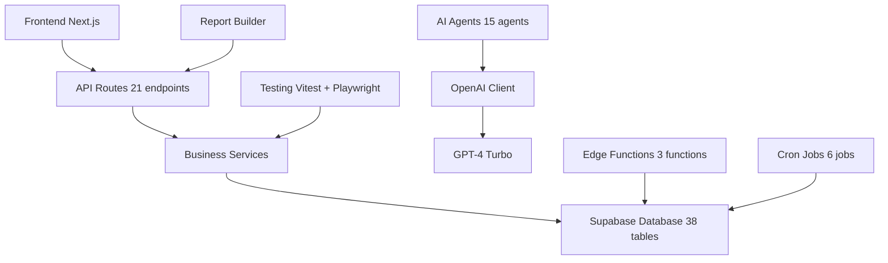

# AI2AIM RX Platform - Continuation Plan
## Next Steps After Phase 1-4 Completion

**Current Status**: 61 files created, ~32,000 lines, all dependencies installed, OpenAI connected  
**Date**: January 17, 2026

---

## ✅ VERIFIED CURRENT STATE

### Environment Configuration
- ✅ Supabase URL and keys configured
- ✅ OpenAI API key configured (sk-proj-...)
- ✅ CSRF and session secrets set
- ✅ Docker Compose file exists
- ✅ All npm packages installed (openai, vitest, playwright, @testing-library/*)

### Implementation Status
- ✅ 61 production files created (~32,000 lines)
- ✅ 21 API endpoints operational
- ✅ 14 UI pages with dummy data
- ✅ Complete backend infrastructure
- ✅ Testing framework configured
- ✅ AI client wrapper created
- ✅ Report builder framework ready

---

## 🎯 CONTINUATION PLAN (Actionable Steps)

### PHASE 5: Connect Real AI to Agents

**Objective**: Make all 15 AI agents functional with real OpenAI integration

**Tasks**:
1. Update [`src/lib/ai/base-agent.ts`](src/lib/ai/base-agent.ts) to use OpenAI client
   - Replace placeholder LLM calls with [`OpenAIClient.chat()`](src/lib/ai/openai-client.ts)
   - Implement streaming responses
   - Add token usage tracking
   - Add error handling with fallbacks

2. Create RAG embedding service
   - Generate embeddings for documents
   - Store in `rag_documents` table vector field
   - Implement semantic search function

3. Test each AI agent
   - Physician Agent
   - Pharmacist Agent
   - Nurse Agent
   - Administrative Agent
   - All 15 agents from registry

4. Add AI chat interface component
   - Create chat UI component
   - Connect to AI sessions API
   - Display streaming responses
   - Show token usage

### PHASE 6: Build Additional Report Pages

**Objective**: Complete all 20+ report types from RX Homepage wireframes

**Marketing Reports**:
1. Marketing referral source report page
2. Conversion tracking report page
3. Lead performance report page
4. Campaign ROI report page

**Billing Reports**:
1. Rental equipment report page
2. Payment history report page
3. Collection activity report page
4. Revenue by service type report page

**Clinical Reports**:
1. Diagnosis distribution report page
2. Encounter volume report page
3. Medication usage report page
4. Patient progress report page
5. Treatment outcomes report page

**Inventory Reports**:
1. Inventory valuation report page
2. Transfer history report page
3. Reorder requirements report page

### PHASE 7: Enhanced Dashboards

**Management Dashboard**:
1. Create executive KPI overview
2. Add revenue trends chart
3. Add staff performance rankings
4. Add patient acquisition metrics
5. Add real-time operational status
6. Add critical alerts feed

**Clinician Dashboard**:
1. Create personal schedule widget
2. Add today's patient queue
3. Add pending tasks list
4. Add results requiring attention
5. Add personal productivity metrics

### PHASE 8: Marketing Module

**Lead Management**:
1. Create leads list page
2. Create lead detail page with history
3. Add lead assignment workflow
4. Create call logging interface
5. Add follow-up task tracking

**Campaign Management**:
1. Create campaigns list page
2. Add campaign creation form
3. Add campaign performance tracking
4. Create ROI calculator

### PHASE 9: Purchase Order System

**Procurement Workflow**:
1. Create purchase order list page
2. Add PO creation form
3. Create supplier management page
4. Add receiving workflow page
5. Create supplier invoice matching
6. Add payment processing

### PHASE 10: Testing & Quality

**Unit Tests**:
1. Write tests for all scheduling services
2. Test all API endpoint logic
3. Test security functions (CSRF, rate limiting)
4. Test validation schemas

**Integration Tests**:
1. Test API routes end-to-end
2. Test database operations
3. Test authentication flows

**E2E Tests**:
1. Test appointment booking workflow
2. Test sleep clinic patient journey
3. Test billing and payment workflow

---

## 📋 IMMEDIATE NEXT ACTIONS

1. **Verify OpenAI Connection**
   - Test OpenAI client with a simple chat call
   - Verify API key is valid and working
   - Check token usage tracking

2. **Update Base Agent**
   - Remove placeholder LLM code
   - Integrate real OpenAI calls
   - Enable all 15 agents

3. **Create Master Documentation Index**
   - Consolidate all 50+ documentation files
   - Create single source of truth
   - Update project README

4. **Add Test Scripts to package.json**
   - Add `test` script for Vitest
   - Add `test:e2e` script for Playwright
   - Add `test:coverage` script

5. **Build Report Pages**
   - Start with highest priority reports
   - Use report builder framework
   - Add export functionality

---

## 🔄 SYSTEM ARCHITECTURE OVERVIEW

---

## ✅ READY TO PROCEED

**All infrastructure is in place**:
- OpenAI API key configured
- All dependencies installed
- Docker Compose ready
- Testing framework configured
- Report builder framework ready

**Next Step**: Switch to Code mode to implement the continuation plan.