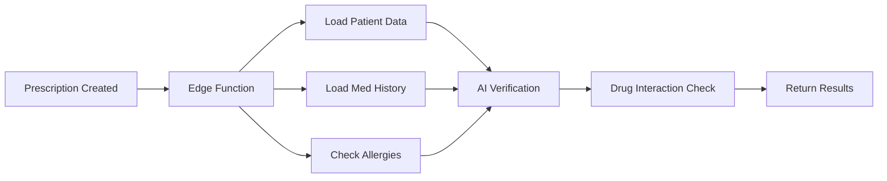
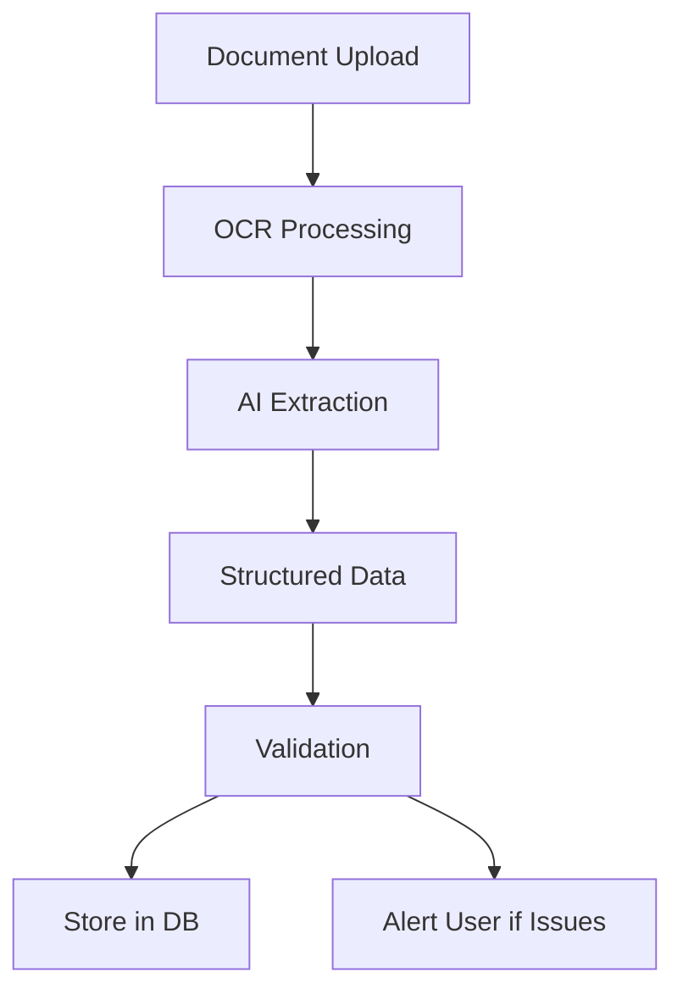
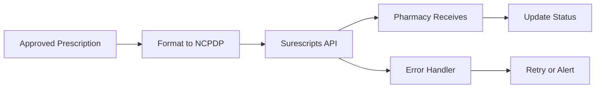

# Edge Functions, CRUD Operations & Cron Jobs - Comprehensive Plan

## Executive Summary

This document outlines all edge functions, CRUD API endpoints, and scheduled jobs needed for the AI2AIM RX platform.

**Total Components**:
- 15 Supabase Edge Functions
- 45+ CRUD API Endpoints (9 resources × 5 operations)
- 12 Cron Jobs (scheduled tasks)
- 8 Webhook Handlers

---

## 🌐 Supabase Edge Functions Architecture

Edge Functions run on Deno at the edge, closer to users for faster response times.

### Use Cases for Edge Functions
1. **Webhooks** - External service callbacks
2. **Heavy Processing** - AI/ML inference, document processing
3. **Third-Party Integrations** - FHIR, e-prescribing, PDMP
4. **Real-time Processing** - Prescription verification, drug interactions
5. **Scheduled Tasks** - Background jobs, cleanups

### Edge Function Structure

```
supabase/functions/
├── prescription-verify/          # Verify prescriptions with AI
├── drug-interaction-check/       # Check drug interactions
├── document-extract/             # Extract data from documents
├── send-notification/            # Send email/SMS notifications
├── e-prescribe-submit/          # Submit to Surescripts
├── fhir-sync/                   # Sync with EHR via FHIR
├── pdmp-check/                  # Check PDMP database
├── insurance-verify/            # Verify insurance eligibility
├── audit-archive/               # Archive old audit logs
├── prescription-expiry-check/   # Check expiring prescriptions
├── cleanup-sessions/            # Clean up old sessions
├── generate-reports/            # Generate scheduled reports
├── backup-verify/               # Verify database backups
├── webhook-stripe/              # Stripe payment webhooks
└── webhook-twilio/              # Twilio SMS webhooks
```

---

## 📋 Edge Functions Detailed Plan

### 1. prescription-verify
**Purpose**: AI-powered prescription verification

**Trigger**: Called when prescription status changes to 'pending'

**Process**:


**Implementation**:
```typescript
// supabase/functions/prescription-verify/index.ts
import { serve } from "https://deno.land/std@0.168.0/http/server.ts"
import { createClient } from "https://esm.sh/@supabase/supabase-js@2"

serve(async (req) => {
  const { prescriptionId } = await req.json()
  
  // 1. Get prescription details
  // 2. Check patient allergies
  // 3. Check drug interactions
  // 4. AI verification
  // 5. Update prescription status
  
  return new Response(
    JSON.stringify({ verified: true }),
    { headers: { "Content-Type": "application/json" } }
  )
})
```

**Dependencies**:
- OpenAI API for AI verification
- Drug interaction database
- Patient allergy records

**Error Handling**:
- Retry logic (3 attempts)
- Fallback to manual verification
- Alert pharmacist on failure

---

### 2. drug-interaction-check
**Purpose**: Check for drug-drug interactions

**Trigger**: Before prescription approval

**Process**:
1. Get all current medications for patient
2. Check against interaction database
3. Calculate severity scores
4. Return warnings

**API**:
```typescript
POST /functions/v1/drug-interaction-check
{
  "patientId": "uuid",
  "newMedication": "medication-name",
  "dosage": "100mg"
}

Response:
{
  "interactions": [
    {
      "medication": "Med A",
      "severity": "major",
      "description": "May cause...",
      "recommendation": "Avoid combination"
    }
  ]
}
```

---

### 3. document-extract
**Purpose**: Extract structured data from medical documents

**Trigger**: Document upload (letters, referrals, lab results)

**Process**:


**Technologies**:
- Tesseract OCR for text extraction
- OpenAI GPT-4 for structured extraction
- Zod for validation

**Output**:
```json
{
  "type": "lab_result",
  "patientName": "John Doe",
  "testDate": "2026-01-15",
  "results": [
    {
      "test": "Glucose",
      "value": "95",
      "unit": "mg/dL",
      "range": "70-100"
    }
  ],
  "confidence": 0.95
}
```

---

### 4. send-notification
**Purpose**: Send notifications via email, SMS, push

**Trigger**: Automation engine or manual trigger

**Process**:
1. Get notification template
2. Populate with data
3. Send via appropriate channel
4. Log delivery status

**Channels**:
- Email (SendGrid)
- SMS (Twilio)
- Push notifications (Firebase)
- In-app notifications (Supabase Realtime)

**Template Variables**:
```javascript
{
  patientName: "John Doe",
  prescriptionNumber: "RX12345",
  medicationName: "Medication Name",
  pickupDate: "2026-01-20",
  pharmacyName: "Main Pharmacy"
}
```

---

### 5. e-prescribe-submit
**Purpose**: Submit prescriptions to Surescripts network

**Trigger**: Prescription approved by physician

**Process**:


**NCPDP Format**:
```xml
<Transmission>
  <TransactionControl>
    <BIN>610020</BIN>
    <Version>D.0</Version>
  </TransactionControl>
  <Claim>
    <Patient>
      <Name>John Doe</Name>
      <DOB>1980-01-15</DOB>
    </Patient>
    <Prescription>
      <DrugName>Medication</DrugName>
      <Quantity>30</Quantity>
    </Prescription>
  </Claim>
</Transmission>
```

---

### 6. fhir-sync
**Purpose**: Sync data with EHR systems via FHIR

**Trigger**: Scheduled (every 15 minutes) or on-demand

**Process**:
1. Fetch changes since last sync
2. Transform to FHIR format
3. POST to EHR FHIR endpoint
4. Handle responses
5. Update sync status

**FHIR Resources**:
- Patient
- MedicationRequest
- MedicationDispense
- Communication

**Example FHIR Bundle**:
```json
{
  "resourceType": "Bundle",
  "type": "transaction",
  "entry": [
    {
      "resource": {
        "resourceType": "MedicationRequest",
        "status": "active",
        "medicationCodeableConcept": {
          "coding": [{
            "system": "http://www.nlm.nih.gov/research/umls/rxnorm",
            "code": "123456"
          }]
        }
      },
      "request": {
        "method": "POST",
        "url": "MedicationRequest"
      }
    }
  ]
}
```

---

### 7. pdmp-check
**Purpose**: Check Prescription Drug Monitoring Program

**Trigger**: Before prescribing controlled substances

**Process**:
1. Format patient info for PDMP API
2. Submit request to state PDMP
3. Parse response
4. Flag concerns
5. Alert prescriber

**Response Handling**:
```typescript
{
  patient: {
    name: "John Doe",
    dob: "1980-01-15"
  },
  prescriptions: [
    {
      drug: "Oxycodone",
      prescriber: "Dr. Smith",
      dispensedDate: "2026-01-01",
      quantity: 30,
      daysSupply: 30
    }
  ],
  alerts: [
    "Multiple prescribers",
    "Early refill pattern"
  ]
}
```

---

### 8. insurance-verify
**Purpose**: Verify insurance eligibility

**Trigger**: Patient registration or prescription creation

**Process**:
1. Call insurance API (270/271 transaction)
2. Check active coverage
3. Check formulary
4. Calculate copay
5. Return eligibility info

**EDI 270 Request**:
```
ISA*00*          *00*          *ZZ*SUBMITTERID   *ZZ*RECEIVERID    *260117*0900*U*00401*000000001*0*P*>~
GS*HS*SENDER*RECEIVER*20260117*0900*1*X*004010X092~
ST*270*0001~
BHT*0022*13*REFNUM*20260117*0900~
HL*1**20*1~
NM1*PR*2*INSURANCE CO*****PI*12345~
HL*2*1*21*1~
NM1*1P*1*DOE*JOHN****MI*1234567890~
HL*3*2*22*0~
TRN*1*1*1234567890~
NM1*IL*1*DOE*JOHN****MI*987654321~
DMG*D8*19800115~
DTP*291*D8*20260117~
EQ*30~
SE*13*0001~
GE*1*1~
IEA*1*000000001~
```

---

### 9-12. Scheduled Maintenance Functions

#### 9. audit-archive
**Schedule**: Daily at 2 AM
**Purpose**: Archive audit logs older than 90 days
**Process**:
```sql
-- Move to archive table
INSERT INTO audit_logs_archive 
SELECT * FROM audit_logs 
WHERE created_at < NOW() - INTERVAL '90 days';

-- Delete from main table
DELETE FROM audit_logs 
WHERE created_at < NOW() - INTERVAL '90 days';
```

#### 10. prescription-expiry-check
**Schedule**: Daily at 8 AM
**Purpose**: Check and notify about expiring prescriptions
**Process**:
1. Find prescriptions expiring in 7 days
2. Generate notifications
3. Alert patients and pharmacists

#### 11. cleanup-sessions
**Schedule**: Hourly
**Purpose**: Clean up expired AI sessions
**Process**:
```sql
DELETE FROM ai_sessions 
WHERE status = 'completed' 
  AND completed_at < NOW() - INTERVAL '24 hours';
```

#### 12. generate-reports
**Schedule**: Weekly on Monday at 6 AM
**Purpose**: Generate weekly summary reports
**Metrics**:
- Prescriptions filled
- Patient visits
- AI agent usage
- Automation executions
- Error rates

---

### 13-15. Webhook Handlers

#### 13. webhook-stripe
**Purpose**: Handle Stripe payment webhooks
**Events**:
- `payment_intent.succeeded`
- `payment_intent.failed`
- `customer.subscription.updated`

#### 14. webhook-twilio
**Purpose**: Handle Twilio SMS webhooks
**Events**:
- Message delivered
- Message failed
- Incoming SMS

#### 15. webhook-builder
**Purpose**: Handle Builder.io content updates
**Events**:
- Content published
- Content unpublished

---

## 🔄 CRUD API Endpoints Structure

### Endpoint Pattern
```
/api/[resource]/
├── GET     - List all (with pagination)
├── POST    - Create new
├── route.ts

/api/[resource]/[id]/
├── GET     - Get single
├── PUT     - Update
├── DELETE  - Delete
├── route.ts
```

### Resources & Endpoints

#### 1. Patients API
```
GET    /api/patients              - List patients
POST   /api/patients              - Create patient
GET    /api/patients/[id]         - Get patient
PUT    /api/patients/[id]         - Update patient
DELETE /api/patients/[id]         - Delete patient
GET    /api/patients/[id]/history - Get medical history
GET    /api/patients/[id]/prescriptions - Get patient prescriptions
```

#### 2. Prescriptions API
```
GET    /api/prescriptions                    - List prescriptions
POST   /api/prescriptions                    - Create prescription
GET    /api/prescriptions/[id]               - Get prescription
PUT    /api/prescriptions/[id]               - Update prescription
DELETE /api/prescriptions/[id]               - Delete prescription
POST   /api/prescriptions/[id]/approve       - Approve prescription
POST   /api/prescriptions/[id]/fill          - Mark as filled
POST   /api/prescriptions/[id]/dispense      - Mark as dispensed
GET    /api/prescriptions/[id]/interactions  - Check interactions
```

#### 3. Medications API
```
GET    /api/medications           - List medications
POST   /api/medications           - Create medication
GET    /api/medications/[id]      - Get medication
PUT    /api/medications/[id]      - Update medication
DELETE /api/medications/[id]      - Delete medication
GET    /api/medications/search    - Search medications
```

#### 4. Communications API
```
GET    /api/communications        - List communications
POST   /api/communications        - Create communication
GET    /api/communications/[id]   - Get communication
PUT    /api/communications/[id]   - Update communication
DELETE /api/communications/[id]   - Delete communication
POST   /api/communications/[id]/read - Mark as read
```

#### 5. AI Agents API
```
GET    /api/ai/agents                - List agents
GET    /api/ai/agents/[id]           - Get agent
POST   /api/ai/sessions              - Create session
GET    /api/ai/sessions/[id]         - Get session
POST   /api/ai/sessions/[id]/message - Send message
DELETE /api/ai/sessions/[id]         - End session
```

#### 6. Automations API
```
GET    /api/automations              - List automations
POST   /api/automations              - Create automation
GET    /api/automations/[id]         - Get automation
PUT    /api/automations/[id]         - Update automation
DELETE /api/automations/[id]         - Delete automation
POST   /api/automations/[id]/execute - Manually execute
GET    /api/automations/[id]/runs    - Get execution history
```

#### 7. RAG Documents API
```
GET    /api/rag/documents         - List documents
POST   /api/rag/documents         - Upload document
GET    /api/rag/documents/[id]    - Get document
DELETE /api/rag/documents/[id]    - Delete document
POST   /api/rag/search            - Semantic search
POST   /api/rag/ingest            - Bulk ingest
```

#### 8. Audit Logs API
```
GET    /api/audit/logs            - List audit logs (admin only)
GET    /api/audit/logs/[id]       - Get specific log
GET    /api/audit/export          - Export logs (CSV)
GET    /api/audit/stats           - Get audit statistics
```

#### 9. User Profiles API
```
GET    /api/users                 - List users (admin only)
GET    /api/users/[id]            - Get user profile
PUT    /api/users/[id]            - Update user profile
DELETE /api/users/[id]            - Delete user (admin only)
PUT    /api/users/[id]/role       - Update user role (admin only)
```

### API Response Format

#### Success Response
```json
{
  "success": true,
  "data": {
    "id": "uuid",
    "...": "..."
  },
  "meta": {
    "timestamp": "2026-01-17T10:00:00Z",
    "requestId": "req_123"
  }
}
```

#### Error Response
```json
{
  "success": false,
  "error": {
    "code": "VALIDATION_ERROR",
    "message": "Invalid input data",
    "details": [
      {
        "field": "email",
        "message": "Invalid email format"
      }
    ]
  },
  "meta": {
    "timestamp": "2026-01-17T10:00:00Z",
    "requestId": "req_123"
  }
}
```

#### Pagination
```json
{
  "success": true,
  "data": [...],
  "pagination": {
    "page": 1,
    "limit": 20,
    "total": 100,
    "pages": 5,
    "hasNext": true,
    "hasPrev": false
  }
}
```

---

## ⏰ Cron Jobs Schedule

### Job Management System

```typescript
// Use node-cron or Supabase pg_cron
import cron from 'node-cron'

// OR in Supabase
SELECT cron.schedule(
  'job-name',
  '0 2 * * *',  -- Daily at 2 AM
  $$SELECT * FROM my_function()$$
);
```

### Scheduled Jobs

#### 1. Prescription Expiry Notifications
```
Schedule: Daily at 8:00 AM
Cron: 0 8 * * *
```
**Tasks**:
- Find prescriptions expiring in 7 days
- Find prescriptions expiring in 24 hours
- Send notifications to patients
- Alert pharmacists

**SQL**:
```sql
SELECT p.*, pat.email, pat.phone
FROM prescriptions p
JOIN patients pat ON p.patient_id = pat.id
WHERE p.expires_at BETWEEN NOW() AND NOW() + INTERVAL '7 days'
  AND p.status = 'filled';
```

---

#### 2. Medication Refill Reminders
```
Schedule: Daily at 9:00 AM
Cron: 0 9 * * *
```
**Tasks**:
- Check refills remaining
- Calculate days supply remaining
- Send refill reminders

---

#### 3. AI Session Cleanup
```
Schedule: Every hour
Cron: 0 * * * *
```
**Tasks**:
```sql
DELETE FROM ai_sessions 
WHERE status = 'completed' 
  AND completed_at < NOW() - INTERVAL '24 hours';

DELETE FROM ai_sessions
WHERE status = 'active'
  AND updated_at < NOW() - INTERVAL '2 hours';
```

---

#### 4. Automation Run Cleanup
```
Schedule: Daily at 1:00 AM
Cron: 0 1 * * *
```
**Tasks**:
```sql
DELETE FROM automation_runs
WHERE status = 'success'
  AND completed_at < NOW() - INTERVAL '30 days';
```

---

#### 5. Audit Log Archival
```
Schedule: Daily at 2:00 AM
Cron: 0 2 * * *
```
**Tasks**:
- Archive logs older than 90 days to cold storage
- Generate archive summary
- Update archive index

---

#### 6. Weekly Reports Generation
```
Schedule: Monday at 6:00 AM
Cron: 0 6 * * 1
```
**Reports**:
- Prescriptions filled (by type, by pharmacist)
- Patient visits
- AI agent usage statistics
- Automation success rates
- Error rates and failures
- Top medications dispensed

---

#### 7. Database Backup Verification
```
Schedule: Daily at 3:00 AM
Cron: 0 3 * * *
```
**Tasks**:
- Verify last backup timestamp
- Check backup file integrity
- Test restore on sample data
- Alert if backup is stale (>24 hours)

---

#### 8. Inactive User Cleanup
```
Schedule: Weekly on Sunday at 4:00 AM
Cron: 0 4 * * 0
```
**Tasks**:
```sql
UPDATE user_profiles 
SET is_active = false
WHERE last_login < NOW() - INTERVAL '90 days'
  AND role != 'admin';
```

---

#### 9. Cache Warming
```
Schedule: Every 6 hours
Cron: 0 */6 * * *
```
**Tasks**:
- Pre-load common medication searches
- Cache frequently accessed patient data
- Refresh dashboard statistics

---

#### 10. Health Check & Monitoring
```
Schedule: Every 5 minutes
Cron: */5 * * * *
```
**Checks**:
- Database connectivity
- Supabase Edge Functions status
- External API availability (Surescripts, FHIR)
- Redis connection
- Storage availability

---

#### 11. Compliance Report Generation
```
Schedule: Monthly on 1st at 7:00 AM
Cron: 0 7 1 * *
```
**Reports**:
- HIPAA audit trail summary
- Access logs review
- Failed login attempts
- Data export/download logs
- Unusual activity patterns

---

#### 12. Prescription Sync (E-Prescribing)
```
Schedule: Every 15 minutes
Cron: */15 * * * *
```
**Tasks**:
- Check Surescripts for prescription updates
- Sync prescription statuses
- Update fill notifications
- Handle pharmacy responses

---

## 🔧 Implementation Priority

### Phase 1: Core CRUD (Week 1-2)
**High Priority**:
1. ✅ Patients API (all endpoints)
2. ✅ Prescriptions API (all endpoints)
3. ✅ Medications API (all endpoints)
4. ✅ Communications API (all endpoints)
5. ✅ User Profiles API (basic endpoints)

### Phase 2: Edge Functions - Essential (Week 3-4)
**High Priority**:
1. ✅ prescription-verify
2. ✅ drug-interaction-check
3. ✅ send-notification
4. ✅ document-extract

### Phase 3: Cron Jobs - Critical (Week 4-5)
**High Priority**:
1. ✅ prescription-expiry-check
2. ✅ ai-session-cleanup
3. ✅ audit-log-archival
4. ✅ health-check-monitoring

### Phase 4: Integrations (Week 6-8)
**Medium Priority**:
1. ⏳ e-prescribe-submit
2. ⏳ fhir-sync
3. ⏳ insurance-verify
4. ⏳ pdmp-check

### Phase 5: Advanced Features (Week 9-12)
**Low Priority**:
1. ⏳ AI Agents API (advanced features)
2. ⏳ Automations API (complex workflows)
3. ⏳ RAG Documents API (semantic search)
4. ⏳ Weekly/monthly reports

---

## 📊 Monitoring & Observability

### Metrics to Track

#### Edge Functions
- Execution time (p50, p95, p99)
- Error rate
- Invocation count
- Cold start frequency
- Memory usage

#### CRUD APIs
- Request rate
- Response time
- Error rate by endpoint
- Validation failures
- Database query time

#### Cron Jobs
- Execution success rate
- Duration per job
- Items processed
- Failures and retries
- Last successful run

### Logging Strategy

```typescript
// Structured logging
{
  timestamp: "2026-01-17T10:00:00Z",
  level: "info",
  service: "edge-function",
  function: "prescription-verify",
  requestId: "req_123",
  userId: "user_456",
  duration: 1234,
  status: "success",
  metadata: {
    prescriptionId: "prx_789"
  }
}
```

---

## 🔒 Security Considerations

### Edge Functions
- ✅ Validate all inputs with Zod
- ✅ Use service role key (server-side only)
- ✅ Implement rate limiting per function
- ✅ Add request signing for webhooks
- ✅ Encrypt sensitive data in transit

### CRUD APIs
- ✅ All protected by middleware CSRF + rate limiting
- ✅ Input validation on all endpoints
- ✅ RLS policies enforce data access
- ✅ Audit logging on all mutations
- ✅ Role-based access control

### Cron Jobs
- ✅ Run with service role credentials
- ✅ Log all operations
- ✅ Implement job locking (prevent concurrent runs)
- ✅ Alert on failures
- ✅ Secure external API credentials

---

## 📝 Next Steps

1. **Review this plan** and provide feedback
2. **Prioritize features** based on business needs
3. **Begin Phase 1 implementation** (Core CRUD)
4. **Set up monitoring** infrastructure
5. **Create deployment pipeline** for edge functions
6. **Document API** with OpenAPI/Swagger

**Estimated Timeline**: 12 weeks for complete implementation
**Team Size**: 2-3 developers
**Dependencies**: Supabase configured, external APIs credentials obtained

---

## 🎯 Success Criteria

- [ ] All CRUD endpoints functional with 95%+ uptime
- [ ] Edge functions executing in <1s (p95)
- [ ] Cron jobs running successfully (>99% success rate)
- [ ] API documentation complete (OpenAPI spec)
- [ ] All endpoints have >80% test coverage
- [ ] Monitoring dashboards configured
- [ ] Error alerts configured (Sentry/PagerDuty)
- [ ] Load testing completed (1000 req/s sustained)

