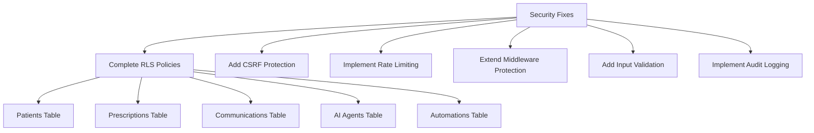
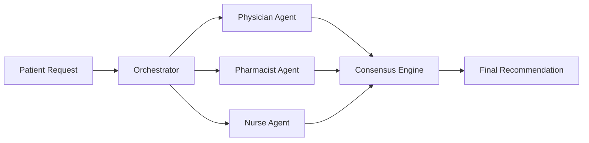

# AI2AIM RX Platform - Innovation & Improvement Plan

## Executive Summary

The AI2AIM RX platform is a well-architected medical prescription management system with a solid foundation. However, there are **critical gaps** in security, testing, and actual AI implementation, alongside **significant innovation opportunities** that could transform it into a market-leading solution.

**Current State**: Foundation is strong with Next.js 14, Supabase, TypeScript, and comprehensive feature scaffolding.

**Issues**: Missing test coverage, placeholder AI implementations, incomplete security policies, and lack of production-ready monitoring.

**Potential**: High potential for innovation in AI/ML, integrations, compliance, and user experience enhancements.

---

## 🚨 Critical Fixes Required

### 1. Security & Compliance (HIGH PRIORITY)

#### Current Issues:
- **Incomplete RLS Policies**: Only 2 basic policies exist for `user_profiles` table
- **Missing CSRF Protection**: No CSRF tokens implemented
- **No Rate Limiting**: API endpoints are vulnerable to abuse
- **Incomplete Route Protection**: Middleware only protects `/dashboard/*` routes
- **No Input Validation**: API routes lack Zod schema validation
- **Missing Audit Logging**: No comprehensive audit trail for HIPAA compliance

#### Required Actions:


**Priority Tasks**:
1. Implement comprehensive RLS policies for all tables based on user roles
2. Add CSRF token validation to all mutation endpoints
3. Implement rate limiting using Upstash Redis or similar
4. Extend middleware to protect all authenticated routes
5. Add Zod validation schemas to all API routes
6. Create audit logging system for all sensitive operations
7. Implement data encryption for PHI fields
8. Add security headers (CSP, HSTS, X-Frame-Options, etc.)

### 2. Testing Infrastructure (HIGH PRIORITY)

#### Current Issues:
- **No Tests**: `tests/` directory is completely empty
- **No Test Framework**: Jest/Vitest not configured
- **No E2E Tests**: No Playwright/Cypress setup
- **No Test Data**: No fixtures or factories
- **No CI/CD**: No automated testing pipeline

#### Required Actions:
```
Testing Pyramid:
├── Unit Tests (70%)
│   ├── AI agent logic
│   ├── Automation engine
│   ├── RAG system
│   ├── Utility functions
│   └── Business logic
├── Integration Tests (20%)
│   ├── API routes
│   ├── Database operations
│   ├── Supabase integration
│   └── Authentication flows
└── E2E Tests (10%)
    ├── User workflows
    ├── Prescription lifecycle
    ├── Patient management
    └── Critical user journeys
```

**Priority Tasks**:
1. Set up Vitest for unit/integration testing
2. Set up Playwright for E2E testing
3. Create test fixtures and factories
4. Write tests for critical business logic
5. Add API route testing
6. Set up test coverage reporting (aim for 80%+)
7. Integrate tests into CI/CD pipeline

### 3. AI Implementation (HIGH PRIORITY)

#### Current Issues:
- **Placeholder LLM Calls**: [`base-agent.ts:110`](src/lib/ai/base-agent.ts:110) returns mock responses
- **No Tool Execution**: [`base-agent.ts:120`](src/lib/ai/base-agent.ts:120) throws "not yet implemented"
- **No RAG Embeddings**: Vector store has no embedding generation
- **Missing MCP Client**: MCP integration is scaffolded but not functional

#### Required Actions:
**Priority Tasks**:
1. Implement actual LLM integration (OpenAI GPT-4, Anthropic Claude)
2. Add embedding generation for RAG documents
3. Implement semantic search functionality
4. Connect MCP tool execution
5. Add agent memory and context management
6. Implement streaming responses for better UX
7. Add token usage tracking and cost monitoring
8. Implement fallback strategies for API failures

### 4. Error Handling & Monitoring (MEDIUM PRIORITY)

#### Current Issues:
- **No Error Tracking**: No Sentry or similar service
- **No Performance Monitoring**: No APM solution
- **Basic Error Handling**: Limited try-catch blocks
- **No Alerting**: No notification system for critical errors
- **No Logging Strategy**: Console.log scattered throughout

#### Required Actions:
**Priority Tasks**:
1. Integrate Sentry for error tracking
2. Add structured logging (Winston, Pino)
3. Implement performance monitoring (Vercel Analytics, New Relic)
4. Set up uptime monitoring (Better Uptime, Pingdom)
5. Create error notification system
6. Add custom error pages
7. Implement retry logic for failed operations
8. Add health check endpoints

### 5. Database & Performance (MEDIUM PRIORITY)

#### Current Issues:
- **No Connection Pooling**: Default Supabase client configuration
- **Missing Indexes**: Some common queries may be slow
- **No Caching**: No Redis or in-memory cache
- **No Query Optimization**: No analyze/explain usage
- **No Database Backups**: Relying solely on Supabase backups

#### Required Actions:
**Priority Tasks**:
1. Implement connection pooling (PgBouncer)
2. Add indexes for frequently queried columns
3. Implement Redis caching for frequently accessed data
4. Add query performance monitoring
5. Implement database backup strategy
6. Add read replicas for scalability
7. Optimize N+1 queries
8. Implement database migration version control

### 6. Missing Configuration Files (LOW PRIORITY)

#### Current Issues:
- **Missing `.env.local.example`**: No template for environment variables
- **No Docker Compose Example**: Docker setup but no sample configs
- **No OpenAPI Spec**: API not documented with OpenAPI/Swagger

#### Required Actions:
**Priority Tasks**:
1. Create comprehensive `.env.local.example`
2. Add OpenAPI/Swagger documentation
3. Create docker-compose.dev.yml example
4. Add VSCode workspace settings
5. Create development environment setup script

---

## 💡 Innovation Opportunities

### 1. Advanced AI Features (HIGH VALUE)

#### Opportunities:
**A. Multi-Agent Collaboration**


**B. Predictive Analytics**
- Drug interaction prediction using ML
- Patient outcome forecasting
- Prescription demand forecasting
- Inventory optimization
- Readmission risk scoring

**C. Natural Language Processing**
- Clinical note extraction
- Voice-to-text prescription entry
- Medical literature summarization
- Automated clinical coding (ICD-10, CPT)
- Sentiment analysis for patient communications

**D. Computer Vision**
- Prescription image OCR
- Pill identification
- Barcode/QR code scanning
- Document classification
- Signature verification

**Implementation Ideas**:
1. Add fine-tuned medical LLM (BioGPT, Med-PaLM)
2. Implement multi-agent debate for critical decisions
3. Add explainable AI for prescription recommendations
4. Create AI-powered clinical decision support
5. Implement automated prior authorization
6. Add drug-drug interaction detection using ML
7. Create personalized medication reminders

### 2. Integration Ecosystem (HIGH VALUE)

#### Opportunities:
**A. Healthcare System Integrations**
```
External Systems:
├── EHR/EMR (Epic, Cerner, AllScripts)
├── Pharmacy Management Systems
├── Insurance/Payer Systems
├── Laboratory Information Systems
├── Radiology (PACS)
├── E-Prescribing Networks (Surescripts)
└── Health Information Exchanges (HIE)
```

**B. Communication Integrations**
- Twilio for SMS notifications
- SendGrid for email
- Slack for team collaboration
- Microsoft Teams integration
- WhatsApp Business API
- Fax integration (still used in healthcare!)

**C. Compliance & Regulatory**
- EPCS (Electronic Prescriptions for Controlled Substances)
- PDMP (Prescription Drug Monitoring Program)
- FDA Drug Database API
- DEA verification
- State licensing verification

**Implementation Ideas**:
1. Build HL7 FHIR API integration layer
2. Add Surescripts integration for e-prescribing
3. Create plugin architecture for easy integrations
4. Implement webhook system for real-time events
5. Add REST/GraphQL API for third-party access
6. Build integration marketplace

### 3. Mobile & Cross-Platform (MEDIUM VALUE)

#### Opportunities:
**A. Native Mobile Apps**
- React Native for iOS/Android
- Offline-first architecture
- Push notifications
- Biometric authentication
- Camera integration for scanning
- NFC for prescription tracking

**B. Progressive Web App (PWA)**
- Offline support
- Install to home screen
- Background sync
- Service workers
- Push notifications
- App shell architecture

**C. Voice Interfaces**
- Alexa Skills for prescription refills
- Google Assistant integration
- Voice-to-text clinical notes
- Hands-free prescription lookup

**Implementation Ideas**:
1. Convert to PWA with offline capabilities
2. Build React Native mobile apps
3. Add voice command support
4. Implement barcode scanning in mobile
5. Create tablet-optimized views for clinicians
6. Add wearable device integration (Apple Watch)

### 4. Enhanced User Experience (MEDIUM VALUE)

#### Opportunities:
**A. Personalization**
- Role-based dashboards
- Customizable widgets
- Saved searches and filters
- Personal preferences
- Dark mode
- Accessibility features (WCAG 2.1 AAA)

**B. Collaboration Features**
- Real-time collaboration
- Comments and annotations
- Task assignment
- Team chat
- Video consultation
- Screen sharing

**C. Advanced Visualizations**
- Interactive charts (Chart.js, D3.js)
- Patient timeline visualization
- Medication interaction graphs
- Analytics dashboards
- Heatmaps for busy times
- Geographic prescription mapping

**Implementation Ideas**:
1. Add customizable dashboard widgets
2. Implement real-time collaborative editing
3. Create advanced analytics with Recharts/D3
4. Add data export to Excel/PDF
5. Implement email digest summaries
6. Create mobile-optimized workflows
7. Add keyboard shortcuts for power users

### 5. Blockchain & Web3 (EMERGING VALUE)

#### Opportunities:
**A. Prescription Tracking**
- Immutable prescription history
- Tamper-proof audit trail
- Smart contracts for refill automation
- Decentralized identity (DID)

**B. Supply Chain**
- Drug authenticity verification
- Counterfeit prevention
- Track and trace pharmaceuticals
- Transparent supply chain

**C. Patient Data Control**
- Patient-controlled health records
- Consent management
- Data sharing with permissions
- Token-based access control

**Implementation Ideas**:
1. Add blockchain audit trail for prescriptions
2. Implement NFT-based prescription verification
3. Create patient data vault with blockchain
4. Add smart contracts for insurance claims
5. Implement decentralized identity verification

### 6. Advanced Analytics & Business Intelligence (HIGH VALUE)

#### Opportunities:
**A. Reporting & Analytics**
```
Analytics Features:
├── Real-time Dashboards
├── Custom Report Builder
├── Scheduled Reports
├── Data Exports
├── Trend Analysis
├── Comparative Analytics
└── Predictive Insights
```

**B. Clinical Analytics**
- Prescription patterns
- Adverse event tracking
- Treatment effectiveness
- Patient cohort analysis
- Medication adherence
- Clinical outcomes measurement

**C. Operational Analytics**
- Workflow efficiency
- Staff productivity
- Resource utilization
- Wait time analysis
- Bottleneck identification
- Cost analysis

**Implementation Ideas**:
1. Integrate Metabase or Superset for BI
2. Add custom report builder
3. Implement data warehouse (Snowflake)
4. Create ML models for predictions
5. Add real-time analytics dashboards
6. Implement A/B testing framework
7. Add conversion funnel analysis

### 7. Automation & Workflow (MEDIUM VALUE)

#### Opportunities:
**A. Enhanced Automation**
- Smart routing of prescriptions
- Automated prior authorizations
- Intelligent task assignment
- Automated compliance checks
- Scheduled medication reviews
- Auto-generated reports

**B. Workflow Optimization**
- Process mining
- Bottleneck detection
- Auto-optimization suggestions
- Load balancing
- Priority queue management
- SLA monitoring

**C. Integration Automation**
- Zapier-like workflow builder
- No-code automation builder
- API workflow orchestration
- Event-driven architecture
- Message queue system (RabbitMQ)

**Implementation Ideas**:
1. Build visual workflow builder (similar to n8n)
2. Add AI-powered automation suggestions
3. Implement event sourcing architecture
4. Create automation marketplace
5. Add workflow templates library
6. Implement business process automation (BPA)

---

## 📋 Implementation Roadmap

### Phase 1: Foundation (Months 1-2)
**Goal**: Fix critical issues and stabilize the platform

```
Week 1-2: Security Hardening
├── Implement comprehensive RLS policies
├── Add CSRF protection
├── Implement rate limiting
├── Add input validation with Zod
└── Set up security headers

Week 3-4: Testing Infrastructure
├── Set up Vitest + Playwright
├── Create test fixtures
├── Write critical path tests
├── Set up coverage reporting
└── Add CI/CD pipeline

Week 5-6: AI Implementation
├── Integrate OpenAI/Anthropic APIs
├── Implement RAG embeddings
├── Add semantic search
├── Connect MCP tools
└── Add streaming responses

Week 7-8: Monitoring & Error Handling
├── Integrate Sentry
├── Add structured logging
├── Set up performance monitoring
├── Create health checks
└── Add alerting system
```

### Phase 2: Enhancement (Months 3-4)
**Goal**: Improve user experience and add key features

```
Week 9-10: Performance Optimization
├── Add Redis caching
├── Optimize database queries
├── Implement connection pooling
├── Add database indexes
└── Set up CDN

Week 11-12: UX Improvements
├── Enhance dashboard customization
├── Add advanced filtering
├── Improve mobile experience
├── Add dark mode
└── Implement accessibility features

Week 13-14: Analytics & Reporting
├── Add analytics dashboards
├── Create report builder
├── Implement data export
├── Add trend analysis
└── Create KPI tracking

Week 15-16: Integration Foundation
├── Build FHIR API layer
├── Add webhook system
├── Create plugin architecture
├── Implement API versioning
└── Add GraphQL endpoint
```

### Phase 3: Innovation (Months 5-6)
**Goal**: Add competitive advantages

```
Week 17-18: Advanced AI Features
├── Multi-agent collaboration
├── Predictive analytics
├── Clinical decision support
├── NLP for clinical notes
└── Drug interaction ML model

Week 19-20: Mobile & PWA
├── Convert to PWA
├── Add offline support
├── Implement push notifications
├── Create mobile apps foundation
└── Add voice commands

Week 21-22: Healthcare Integrations
├── E-prescribing (Surescripts)
├── EHR/EMR integration
├── Insurance verification
├── PDMP integration
└── Lab integration

Week 23-24: Advanced Features
├── Telemedicine integration
├── Blockchain audit trail
├── Advanced automation workflows
├── BI/analytics platform
└── Compliance automation
```

---

## 💰 Cost-Benefit Analysis

### Quick Wins (High Impact, Low Effort)
1. **Add .env.local.example** - 30 minutes
2. **Implement basic RLS policies** - 4 hours
3. **Add CSRF protection** - 2 hours
4. **Set up Sentry** - 1 hour
5. **Add rate limiting** - 3 hours
6. **Create health check endpoint** - 1 hour

### High Impact, Medium Effort
1. **Complete testing infrastructure** - 2 weeks
2. **Implement actual AI/LLM integration** - 1 week
3. **Add Redis caching** - 3 days
4. **Implement comprehensive audit logging** - 1 week
5. **Add analytics dashboards** - 2 weeks

### High Impact, High Effort
1. **E-prescribing integration** - 2 months
2. **EHR/EMR integration** - 3 months
3. **Mobile apps (React Native)** - 2 months
4. **Advanced AI features (multi-agent)** - 1 month
5. **Blockchain integration** - 2 months

### Innovation Priorities
**Must Have** (Essential for production):
- Complete security implementation
- Testing infrastructure
- Actual AI implementation
- Error monitoring
- Performance optimization

**Should Have** (Competitive advantages):
- Advanced analytics
- E-prescribing integration
- Mobile optimization/PWA
- Enhanced automation
- Clinical decision support

**Could Have** (Future differentiation):
- Blockchain features
- Voice interfaces
- Advanced ML models
- Telemedicine
- Integration marketplace

**Won't Have** (Not now):
- Web3 features
- Custom blockchain
- Hardware integration (robots)
- Complex cryptography

---

## 🎯 Key Recommendations

### Immediate Actions (This Week)
1. Create `.env.local.example` with all required variables
2. Implement basic RLS policies for all tables
3. Set up error tracking with Sentry
4. Add input validation to API routes
5. Document current security gaps

### Short Term (This Month)
1. Set up comprehensive testing infrastructure
2. Implement actual LLM integration (OpenAI/Anthropic)
3. Add rate limiting and CSRF protection
4. Implement comprehensive audit logging
5. Set up CI/CD pipeline with automated tests
6. Add performance monitoring

### Medium Term (3 Months)
1. Complete all security and compliance features
2. Achieve 80%+ test coverage
3. Implement advanced AI features (RAG, multi-agent)
4. Add analytics and reporting capabilities
5. Convert to PWA with offline support
6. Begin EHR/EMR integration planning

### Long Term (6 Months)
1. Complete e-prescribing integration
2. Launch mobile apps (iOS/Android)
3. Implement advanced ML models
4. Build integration marketplace
5. Add telemedicine capabilities
6. Achieve HITRUST certification

---

## 📊 Success Metrics

### Technical Metrics
- **Test Coverage**: 80%+ (currently 0%)
- **Uptime**: 99.9%+
- **API Response Time**: <200ms p95
- **Error Rate**: <0.1%
- **Security Score**: A+ on Mozilla Observatory
- **Lighthouse Score**: 90+ across all categories

### Business Metrics
- **User Adoption**: Track active users
- **Prescription Volume**: Track processed prescriptions
- **Time Savings**: Measure workflow efficiency
- **Error Reduction**: Track medication errors prevented
- **Compliance**: 100% audit success rate
- **User Satisfaction**: NPS score 50+

### Innovation Metrics
- **AI Accuracy**: 95%+ for document extraction
- **Automation Rate**: 70% of routine tasks automated
- **Integration Coverage**: 80% of common EHR systems
- **Mobile Usage**: 40%+ of users on mobile
- **API Adoption**: Track third-party integrations

---

## 🔒 Security & Compliance Considerations

### HIPAA Requirements
✅ **Currently Implemented**:
- Database encryption at rest (Supabase)
- HTTPS encryption in transit
- Basic authentication
- Some RLS policies

❌ **Missing**:
- Comprehensive audit logging
- Complete access controls
- Automatic logoff
- Data backup procedures
- Disaster recovery plan
- Business Associate Agreements (BAA)
- Risk assessment documentation
- Breach notification procedures

### Action Items for HIPAA Compliance
1. Complete audit trail implementation
2. Document all security policies
3. Implement automatic session timeout
4. Create incident response plan
5. Add data backup and recovery
6. Obtain BAA from all vendors
7. Conduct security risk assessment
8. Implement breach notification system
9. Add physical safeguard documentation
10. Create employee training program

---

## 🎓 Learning & Development Needs

### Team Skills Required
**For Critical Fixes**:
- Security best practices (OWASP Top 10)
- Testing frameworks (Vitest, Playwright)
- LLM integration (OpenAI, Anthropic)
- PostgreSQL optimization
- Error monitoring (Sentry)

**For Innovation**:
- Machine learning (TensorFlow, PyTorch)
- HL7 FHIR standards
- Mobile development (React Native)
- Blockchain fundamentals
- Voice interface development
- Advanced RAG techniques

### Recommended Training
1. HIPAA compliance certification
2. Security testing certification
3. AI/ML for healthcare
4. HL7 FHIR integration
5. React Native development
6. Database performance tuning

---

## 📝 Next Steps

### Decision Points
1. **Budget Allocation**: Prioritize security vs. innovation?
2. **Timeline**: Aggressive (3 months) vs. steady (6 months)?
3. **Team Size**: Hire contractors or build in-house?
4. **Technology Choices**: Which LLM provider, which integrations?
5. **Compliance Timeline**: When is HIPAA certification required?

### Recommendations for Discussion
1. **Security First**: Prioritize Phases 1 fixes before innovation
2. **Start Testing Now**: Begin building test infrastructure immediately
3. **Pick One LLM**: Start with OpenAI (easier) or Anthropic (better safety)
4. **PWA Before Native**: Convert to PWA before building separate mobile apps
5. **Integration Strategy**: Start with one EHR integration as proof of concept

---

## 📞 Consultation Questions

Before proceeding with implementation, let's discuss:

1. **What is your primary goal**: Security/compliance or innovation/features?
2. **What is your timeline**: When do you need to launch?
3. **What is your budget**: For development, integrations, and third-party services?
4. **Who are your users**: Are you targeting hospitals, clinics, or pharmacies?
5. **What integrations are critical**: Which systems must you integrate with?
6. **What compliance level**: Do you need HIPAA, HITRUST, or other certifications?
7. **What is your team size**: Do you need to hire, or can current team handle it?

---

## Summary

Your AI2AIM RX platform has **excellent architecture** and **comprehensive features**, but needs:

**Critical Fixes** (Do First):
1. Complete security implementation (RLS, CSRF, validation)
2. Add testing infrastructure (0% → 80% coverage)
3. Implement actual AI/LLM functionality
4. Add monitoring and error tracking
5. Create proper documentation

**Best Innovations** (Do Next):
1. Advanced AI with multi-agent collaboration
2. E-prescribing and EHR integrations
3. Mobile apps and PWA
4. Advanced analytics and BI
5. Clinical decision support

**Timeline Suggestion**: 
- Month 1-2: Fix critical issues
- Month 3-4: Enhance UX and performance
- Month 5-6: Add innovations

**Estimated Effort**: 6 months with 3-4 developers

This platform has significant potential to become a leading solution in the medical RX space with the right investment in security, testing, and strategic innovations.
