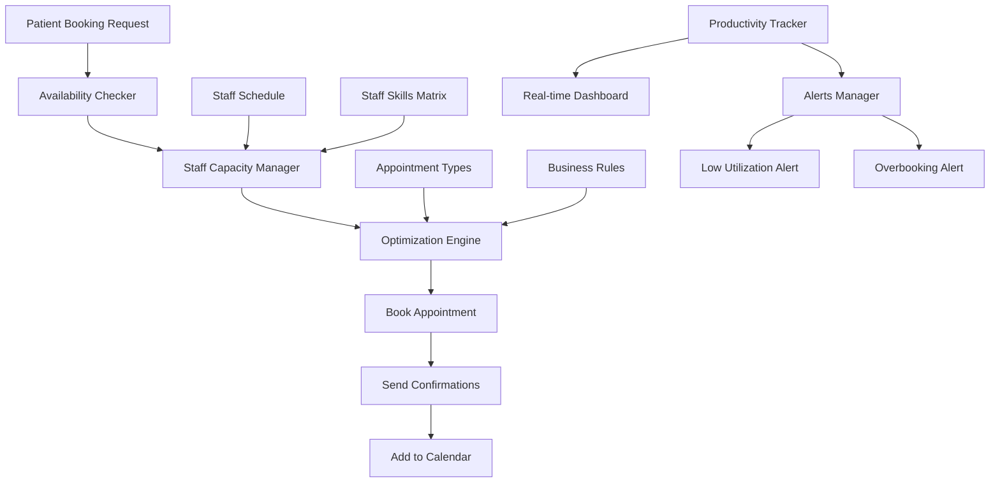
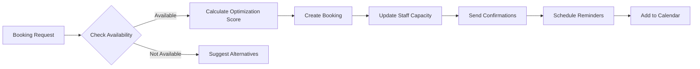
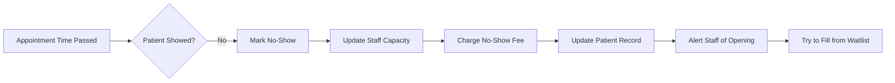

# Staff Scheduling & Productivity Management System

## 🎯 Business Objective

**GOAL**: Maximize staff productivity by ensuring all clinical staff are fully booked with appropriate appointments, minimizing idle time and maximizing revenue.

**Key Metrics**:
- Staff utilization rate (target: >85%)
- Average appointments per day per staff
- Revenue per staff member per day
- Booking fill rate (target: >90%)
- No-show rate (target: <5%)
- Cancellation rate (target: <10%)

---

## 📊 System Architecture



---

## 🗄️ Database Schema

### 1. Staff Schedules Table

```sql
CREATE TYPE day_of_week AS ENUM (
  'monday', 'tuesday', 'wednesday', 'thursday', 'friday', 'saturday', 'sunday'
);

CREATE TYPE appointment_status AS ENUM (
  'scheduled', 'confirmed', 'checked_in', 'in_progress', 
  'completed', 'no_show', 'cancelled', 'rescheduled'
);

CREATE TABLE public.staff_schedules (
  id UUID PRIMARY KEY DEFAULT uuid_generate_v4(),
  staff_id UUID NOT NULL REFERENCES public.user_profiles(id) ON DELETE CASCADE,
  day_of_week day_of_week NOT NULL,
  start_time TIME NOT NULL,
  end_time TIME NOT NULL,
  is_active BOOLEAN DEFAULT TRUE,
  effective_from DATE,
  effective_until DATE,
  break_start TIME, -- lunch break
  break_end TIME,
  max_appointments_per_day INTEGER DEFAULT 16,
  default_appointment_duration INTEGER DEFAULT 30, -- minutes
  notes TEXT,
  created_at TIMESTAMPTZ DEFAULT NOW(),
  updated_at TIMESTAMPTZ DEFAULT NOW()
);

-- Appointments/Bookings Table
CREATE TABLE public.appointments (
  id UUID PRIMARY KEY DEFAULT uuid_generate_v4(),
  appointment_number TEXT UNIQUE NOT NULL,
  patient_id UUID NOT NULL REFERENCES public.patients(id) ON DELETE CASCADE,
  staff_id UUID NOT NULL REFERENCES public.user_profiles(id) ON DELETE CASCADE,
  appointment_type TEXT NOT NULL, -- 'consultation', 'sleep_study_setup', 'cpap_training', 'follow_up'
  appointment_date DATE NOT NULL,
  start_time TIME NOT NULL,
  end_time TIME NOT NULL,
  duration_minutes INTEGER NOT NULL,
  status appointment_status DEFAULT 'scheduled',
  priority TEXT DEFAULT 'normal', -- 'urgent', 'high', 'normal', 'low'
  
  -- Related records
  related_prescription_id UUID REFERENCES public.prescriptions(id) ON DELETE SET NULL,
  related_sleep_study_id UUID REFERENCES public.sleep_studies(id) ON DELETE SET NULL,
  related_dme_prescription_id UUID REFERENCES public.dme_prescriptions(id) ON DELETE SET NULL,
  
  -- Booking info
  booked_by UUID REFERENCES public.user_profiles(id),
  booked_at TIMESTAMPTZ DEFAULT NOW(),
  confirmed_at TIMESTAMPTZ,
  checked_in_at TIMESTAMPTZ,
  completed_at TIMESTAMPTZ,
  
  -- Patient communication
  phone_reminder_sent BOOLEAN DEFAULT FALSE,
  email_reminder_sent BOOLEAN DEFAULT FALSE,
  sms_reminder_sent BOOLEAN DEFAULT FALSE,
  
  -- Notes
  reason_for_visit TEXT,
  special_instructions TEXT,
  cancellation_reason TEXT,
  no_show_reason TEXT,
  notes TEXT,
  
  created_at TIMESTAMPTZ DEFAULT NOW(),
  updated_at TIMESTAMPTZ DEFAULT NOW()
);

-- Appointment Types Configuration
CREATE TABLE public.appointment_types (
  id UUID PRIMARY KEY DEFAULT uuid_generate_v4(),
  type_code TEXT UNIQUE NOT NULL,
  name TEXT NOT NULL,
  description TEXT,
  default_duration INTEGER NOT NULL, -- minutes
  color_code TEXT, -- for calendar display
  requires_equipment BOOLEAN DEFAULT FALSE,
  equipment_type TEXT, -- 'sleep_monitor', 'cpap_machine', etc.
  revenue_value DECIMAL(10, 2), -- expected revenue
  requires_staff_role user_role[], -- which roles can perform this
  preparation_time INTEGER DEFAULT 5, -- minutes before
  cleanup_time INTEGER DEFAULT 5, -- minutes after
  buffer_time INTEGER DEFAULT 10, -- gap between appointments
  is_active BOOLEAN DEFAULT TRUE,
  created_at TIMESTAMPTZ DEFAULT NOW(),
  updated_at TIMESTAMPTZ DEFAULT NOW()
);

-- Staff Capacity Tracking (real-time)
CREATE TABLE public.staff_capacity (
  id UUID PRIMARY KEY DEFAULT uuid_generate_v4(),
  staff_id UUID NOT NULL REFERENCES public.user_profiles(id) ON DELETE CASCADE,
  date DATE NOT NULL,
  total_available_minutes INTEGER NOT NULL,
  booked_minutes INTEGER DEFAULT 0,
  completed_minutes INTEGER DEFAULT 0,
  blocked_minutes INTEGER DEFAULT 0, -- PTO, meetings, etc.
  utilization_percentage DECIMAL(5, 2) DEFAULT 0,
  appointments_scheduled INTEGER DEFAULT 0,
  appointments_completed INTEGER DEFAULT 0,
  no_shows INTEGER DEFAULT 0,
  cancellations INTEGER DEFAULT 0,
  revenue_expected DECIMAL(10, 2) DEFAULT 0,
  revenue_actual DECIMAL(10, 2) DEFAULT 0,
  updated_at TIMESTAMPTZ DEFAULT NOW(),
  UNIQUE(staff_id, date)
);

-- Staff Time Off / Blocked Time
CREATE TABLE public.staff_time_off (
  id UUID PRIMARY KEY DEFAULT uuid_generate_v4(),
  staff_id UUID NOT NULL REFERENCES public.user_profiles(id) ON DELETE CASCADE,
  start_date DATE NOT NULL,
  end_date DATE NOT NULL,
  start_time TIME, -- null = all day
  end_time TIME,
  reason TEXT, -- 'vacation', 'sick', 'meeting', 'training', 'blocked'
  is_approved BOOLEAN DEFAULT FALSE,
  approved_by UUID REFERENCES public.user_profiles(id),
  notes TEXT,
  created_at TIMESTAMPTZ DEFAULT NOW(),
  updated_at TIMESTAMPTZ DEFAULT NOW()
);

-- Booking Rules (business logic)
CREATE TABLE public.booking_rules (
  id UUID PRIMARY KEY DEFAULT uuid_generate_v4(),
  rule_name TEXT UNIQUE NOT NULL,
  rule_type TEXT NOT NULL, -- 'availability', 'capacity', 'buffer', 'priority'
  staff_role user_role, -- applies to specific role
  appointment_type TEXT, -- applies to specific appointment type
  rule_config JSONB NOT NULL,
  is_active BOOLEAN DEFAULT TRUE,
  priority INTEGER DEFAULT 0,
  created_at TIMESTAMPTZ DEFAULT NOW(),
  updated_at TIMESTAMPTZ DEFAULT NOW()
);
```

---

## 📊 Productivity Metrics & KPIs

### Staff-Level Metrics

```typescript
interface StaffProductivityMetrics {
  staffId: string
  staffName: string
  role: string
  period: {
    start: Date
    end: Date
  }
  
  // Utilization Metrics
  totalAvailableHours: number
  bookedHours: number
  completedHours: number
  utilizationRate: number // (bookedHours / totalAvailableHours) * 100
  
  // Appointment Metrics
  appointmentsScheduled: number
  appointmentsCompleted: number
  appointmentsCancelled: number
  noShows: number
  completionRate: number // (completed / scheduled) * 100
  noShowRate: number // (noShows / scheduled) * 100
  
  // Revenue Metrics
  revenueExpected: number
  revenueActual: number
  revenuePerHour: number
  
  // Efficiency Metrics
  avgAppointmentDuration: number
  appointmentsPerDay: number
  avgGapBetweenAppointments: number
  
  // Quality Metrics
  patientSatisfactionScore?: number
  returnPatientRate?: number
}
```

### Clinic-Level Metrics

```typescript
interface ClinicProductivityMetrics {
  period: {
    start: Date
    end: Date
  }
  
  // Overall Utilization
  totalStaffHours: number
  totalBookedHours: number
  totalCompletedHours: number
  clinicUtilizationRate: number
  
  // Capacity Management
  totalCapacity: number // max possible appointments
  appointmentsBooked: number
  capacityFillRate: number
  
  // Revenue
  totalRevenueExpected: number
  totalRevenueActual: number
  revenuePerStaffMember: number
  
  // Staff Performance
  staffMetrics: StaffProductivityMetrics[]
  topPerformers: StaffProductivityMetrics[]
  underutilizedStaff: StaffProductivityMetrics[]
  
  // Trends
  trendingUp: boolean
  weekOverWeekGrowth: number
  monthOverMonthGrowth: number
}
```

---

## 🎯 Booking Optimization System

### Intelligent Booking Algorithm

```typescript
interface BookingOptimization {
  // Input
  patientId: string
  appointmentType: string
  preferredDate?: Date
  preferredTime?: string
  preferredStaff?: string
  urgency: 'urgent' | 'high' | 'normal' | 'low'
  
  // Algorithm considers:
  factors: {
    staffUtilization: number // prefer underutilized staff
    staffExpertise: number // match skills to appointment
    patientHistory: number // continuity of care
    travelTime: number // if mobile service
    equipmentAvailability: number
    revenueOptimization: number
  }
  
  // Output
  recommendations: Array<{
    staffId: string
    staffName: string
    dateTime: Date
    score: number // 0-100 optimization score
    utilizationImpact: number // how much this helps utilization
    reasoning: string[]
  }>
}
```

### Optimization Rules

1. **Fill Gaps First**: Prefer time slots that fill gaps in schedule
2. **Balance Workload**: Distribute appointments evenly across staff
3. **Skill Matching**: Assign based on staff expertise
4. **Continuity**: Keep patients with same staff when possible
5. **Revenue Maximization**: Prioritize high-value appointments
6. **Geographic Efficiency**: Group nearby locations for mobile services

---

## 🚀 Implementation Plan

### Phase 1: Database Schema (Day 1)
**Migration 008: Staff Scheduling**

```sql
-- Create all tables above
-- Add indexes
-- Add RLS policies
-- Add triggers for capacity updates
```

### Phase 2: Booking APIs (Day 2-3)

```typescript
// Core Booking APIs
POST   /api/appointments                    // Create booking
GET    /api/appointments                    // List appointments
GET    /api/appointments/[id]               // Get appointment
PUT    /api/appointments/[id]               // Update appointment
DELETE /api/appointments/[id]               // Cancel appointment

// Specialized Endpoints
GET    /api/appointments/availability       // Check availability
POST   /api/appointments/find-optimal       // Find best slot
POST   /api/appointments/[id]/confirm       // Confirm appointment
POST   /api/appointments/[id]/check-in      // Check in patient
POST   /api/appointments/[id]/complete      // Mark complete
POST   /api/appointments/[id]/reschedule    // Reschedule

// Staff Schedule Management
GET    /api/staff/[id]/schedule             // Get staff schedule
PUT    /api/staff/[id]/schedule             // Update schedule
GET    /api/staff/[id]/capacity             // Get capacity stats
POST   /api/staff/[id]/time-off             // Request time off

// Productivity & Reporting
GET    /api/staff/[id]/productivity         // Individual metrics
GET    /api/productivity/clinic             // Clinic-wide metrics
GET    /api/productivity/underutilized      // Find underutilized staff
GET    /api/productivity/report             // Generate report
```

### Phase 3: Business Logic Services (Day 4)

```typescript
// src/lib/scheduling/booking-service.ts
class BookingService {
  async findOptimalSlot(criteria: BookingCriteria): Promise<TimeSlot[]>
  async checkAvailability(staffId: string, date: Date): Promise<TimeSlot[]>
  async createBooking(booking: BookingRequest): Promise<Appointment>
  async handleNoShow(appointmentId: string): Promise<void>
  async handleCancellation(appointmentId: string, reason: string): Promise<void>
}

// src/lib/scheduling/capacity-manager.ts
class CapacityManager {
  async calculateDailyCapacity(staffId: string, date: Date): Promise<Capacity>
  async updateUtilization(staffId: string, date: Date): Promise<void>
  async getUnderutilizedStaff(threshold: number): Promise<StaffMember[]>
  async optimizeSchedule(date: Date): Promise<ScheduleOptimization>
}

// src/lib/scheduling/productivity-tracker.ts
class ProductivityTracker {
  async getStaffMetrics(staffId: string, period: Period): Promise<Metrics>
  async getClinicMetrics(period: Period): Promise<ClinicMetrics>
  async identifyBottlenecks(): Promise<Bottleneck[]>
  async generateProductivityReport(period: Period): Promise<Report>
}
```

### Phase 4: UI Components (Day 5)

```typescript
// src/components/scheduling/calendar-view.tsx
// Full calendar with drag-drop booking

// src/components/scheduling/staff-utilization-dashboard.tsx
// Real-time utilization metrics

// src/components/scheduling/booking-form.tsx
// Optimized booking form with smart suggestions

// src/components/scheduling/productivity-charts.tsx
// Charts showing staff productivity trends
```

---

## 📈 Productivity Dashboard Design

### Real-Time Staff Utilization View

```
┌─────────────────────────────────────────────────────────────┐
│  Staff Productivity Dashboard - Today                       │
├─────────────────────────────────────────────────────────────┤
│  Overall Clinic Utilization: 87% ✅                         │
│  Total Appointments Today: 42 / 48 capacity (88%)           │
│  Revenue Today: $8,420 / $9,600 expected (88%)              │
└─────────────────────────────────────────────────────────────┘

┌──────────┬────────────┬─────────┬──────────┬──────────┐
│ Staff    │ Role       │ Booked  │ Util. %  │ Status   │
├──────────┼────────────┼─────────┼──────────┼──────────┤
│ Dr. Smith│ Physician  │ 8/8     │ 100% 🟢  │ Booked   │
│ J. Doe   │ Technician │ 7/8     │ 88%  🟢  │ Available│
│ M. Jones │ Nurse      │ 6/8     │ 75%  🟡  │ Available│
│ S. Wilson│ Admin      │ 4/8     │ 50%  🔴  │ Needs    │
│          │            │         │          │ Booking  │
└──────────┴────────────┴─────────┴──────────┴──────────┘

┌─────────────────────────────────────────────────────────────┐
│  Alerts & Actions                                            │
├─────────────────────────────────────────────────────────────┤
│  🔴 S. Wilson has only 50% utilization - 4 open slots       │
│  🟡 M. Jones has 2 open afternoon slots                     │
│  ✅ Dr. Smith is fully booked                               │
│                                                              │
│  [Auto-Fill Empty Slots] [Send Reminders] [View Calendar]  │
└─────────────────────────────────────────────────────────────┘
```

---

## 🤖 Intelligent Booking Features

### 1. Auto-Fill Algorithm

**When staff utilization drops below 75%**:

```typescript
async function autoFillOpenSlots() {
  // 1. Find underutilized staff
  const underutilized = await getStaffWithOpenSlots(threshold: 0.75)
  
  // 2. Find patients needing appointments
  const waitlist = await getPatientsOnWaitlist()
  const followUpsDue = await getFollowUpsDue()
  const complianceChecks = await getCPAPComplianceChecksDue()
  
  // 3. Match patients to optimal slots
  for (const staff of underutilized) {
    const openSlots = staff.openSlots
    const matchedPatients = await findBestMatches(
      openSlots,
      [...waitlist, ...followUpsDue, ...complianceChecks]
    )
    
    // 4. Auto-book or send booking suggestions
    for (const match of matchedPatients) {
      await sendBookingSuggestion(match.patient, match.slot, staff)
    }
  }
}
```

### 2. Smart Scheduling Assistant

**When booking, show AI suggestions**:

```typescript
interface SmartSuggestion {
  slot: TimeSlot
  staff: StaffMember
  score: number
  reasons: string[]
}

// Example suggestions
{
  score: 95,
  slot: "2026-01-20 10:00 AM",
  staff: "Dr. Smith",
  reasons: [
    "Dr. Smith has opening at preferred time",
    "Patient's previous provider for continuity",
    "Fills gap in Dr. Smith's schedule (currently 70% utilization)",
    "Before lunch - optimal for sleep consultations"
  ]
}
```

### 3. No-Show Prediction & Prevention

```typescript
interface NoShowRiskScore {
  appointmentId: string
  riskScore: number // 0-100
  factors: {
    pastNoShowRate: number
    appointmentTime: string // morning appointments have lower no-show
    daysUntilAppointment: number // <48 hours = higher risk
    confirmationStatus: boolean
    patientEngagement: number
  }
  recommendations: string[]
}

// If risk > 70%, take action
if (riskScore > 70) {
  actions = [
    "Send extra reminder 24 hours before",
    "Request confirmation via call",
    "Add to waitlist for replacement",
    "Send SMS on morning of appointment"
  ]
}
```

---

## 📱 Mobile-First Booking Experience

### Patient Self-Booking Portal

```typescript
// src/app/(patient)/book-appointment/page.tsx

1. Select appointment type
   ├─ Initial Consultation
   ├─ Sleep Study Setup
   ├─ CPAP Training
   ├─ Follow-up Visit
   └─ Equipment Pickup

2. View available slots (AI-optimized)
   ├─ Recommended: Mon Jan 20, 10 AM (Dr. Smith) ⭐
   ├─ Available: Mon Jan 20, 2 PM (Dr. Jones)
   ├─ Available: Tue Jan 21, 9 AM (Dr. Smith)
   └─ More options...

3. Book & confirm
   ├─ SMS confirmation sent
   ├─ Email calendar invite sent
   ├─ Reminders scheduled (24h, 2h before)
   └─ Staff capacity automatically updated
```

---

## ⚡ Real-Time Capacity Updates

### WebSocket/Realtime Updates

```typescript
// Subscribe to capacity changes
const channel = supabase
  .channel('staff-capacity')
  .on('postgres_changes', {
    event: '*',
    schema: 'public',
    table: 'staff_capacity'
  }, (payload) => {
    updateDashboard(payload.new)
    
    // Alert if utilization drops
    if (payload.new.utilization_percentage < 75) {
      showAlert(`${payload.new.staff_name} has low utilization`)
    }
  })
  .subscribe()
```

---

## 🎯 Business Rules Engine

### Configurable Booking Rules

```typescript
// Example rules
const bookingRules = [
  {
    name: "minimum-utilization-alert",
    type: "capacity",
    config: {
      threshold: 75,
      action: "alert_admin",
      message: "Staff member below 75% utilization"
    }
  },
  {
    name: "optimal-appointment-spacing",
    type: "buffer",
    config: {
      minimumGap: 10, // minutes
      maximumGap: 30, // minutes
      preferredGap: 15
    }
  },
  {
    name: "urgent-appointment-priority",
    type: "priority",
    config: {
      appointmentType: "urgent",
      allowOverbooking: true,
      maxOverbookingSlots: 2
    }
  },
  {
    name: "lunch-break-protection",
    type: "availability",
    config: {
      startTime: "12:00",
      endTime: "13:00",
      blockBookings: true
    }
  }
]
```

---

## 📊 Analytics & Reports

### Daily Staff Utilization Report

```sql
-- Daily productivity report
SELECT 
  up.full_name,
  up.role,
  sc.date,
  sc.total_available_minutes / 60.0 as hours_available,
  sc.booked_minutes / 60.0 as hours_booked,
  sc.completed_minutes / 60.0 as hours_completed,
  sc.utilization_percentage,
  sc.appointments_scheduled,
  sc.appointments_completed,
  sc.no_shows,
  sc.revenue_actual,
  sc.revenue_actual / NULLIF(sc.completed_minutes / 60.0, 0) as revenue_per_hour
FROM public.staff_capacity sc
JOIN public.user_profiles up ON sc.staff_id = up.id
WHERE sc.date = CURRENT_DATE
ORDER BY sc.utilization_percentage ASC;
```

### Underutilization Alert Query

```sql
-- Find staff with <75% utilization
SELECT 
  up.full_name,
  up.role,
  sc.utilization_percentage,
  (sc.total_available_minutes - sc.booked_minutes) / 60.0 as hours_available,
  ARRAY(
    SELECT CONCAT(start_time, '-', end_time)
    FROM appointments
    WHERE staff_id = up.id AND appointment_date = sc.date
    ORDER BY start_time
  ) as booked_slots
FROM public.staff_capacity sc
JOIN public.user_profiles up ON sc.staff_id = up.id
WHERE sc.date >= CURRENT_DATE
  AND sc.utilization_percentage < 75
  AND up.role IN ('physician', 'nurse', 'administrative')
ORDER BY sc.utilization_percentage ASC, sc.date ASC;
```

---

## 🔔 Automated Notifications

### Staff Utilization Alerts

```typescript
// Trigger: Every hour during business hours
cron.schedule('0 9-17 * * *', async () => {
  const underutilized = await getUnderutilizedStaff(75)
  
  for (const staff of underutilized) {
    // Alert admin
    await sendNotification({
      to: 'admin',
      type: 'low_utilization',
      message: `${staff.name} has only ${staff.utilization}% utilization with ${staff.openSlots} open slots`,
      actionUrl: `/scheduling/staff/${staff.id}`,
      actions: ['View Schedule', 'Auto-Fill Slots', 'Send Outreach']
    })
    
    // Suggest patients from waitlist
    const suggestions = await findPatientsForOpenSlots(staff.id, staff.openSlots)
    await sendBookingSuggestions(suggestions)
  }
})
```

### Patient Booking Reminders

```typescript
// 48 hours before
await sendReminder({
  to: patient.email,
  subject: "Appointment Reminder - 2 Days",
  template: "appointment-reminder-48h",
  data: { appointmentDate, staffName, location }
})

// 24 hours before
await sendSMS({
  to: patient.phone,
  message: `Reminder: Sleep study appointment tomorrow at ${time} with ${staff}. Reply CONFIRM`
})

// 2 hours before
await sendPushNotification({
  title: "Appointment in 2 hours",
  body: `Your appointment with ${staff} is at ${time}`,
  action: "View Directions"
})
```

---

## 🎨 UI/UX Design

### 1. Admin Dashboard View

**Staff Utilization Grid** (Color-coded):
- 🟢 Green: >85% utilization (optimal)
- 🟡 Yellow: 70-85% utilization (acceptable)
- 🔴 Red: <70% utilization (needs attention)

**Quick Actions**:
- [Auto-Fill All Open Slots]
- [Send Waitlist Invites]
- [Generate Weekly Schedule]
- [Export Productivity Report]

### 2. Staff Member View

**Personal Schedule**:
- Calendar view with all appointments
- Utilization percentage
- Daily productivity stats
- Upcoming appointments
- Time-off requests

### 3. Booking Form with AI

**Smart Booking**:
```
1. Select Patient: [John Doe ▼]
2. Appointment Type: [Sleep Study Setup ▼]
3. Preferred Date: [2026-01-20 📅]

AI Recommendations:
⭐ Best Match: Dr. Smith - Mon Jan 20, 10:00 AM
   • Fills morning gap (improves utilization from 65% to 80%)
   • Patient's previous physician (continuity of care)
   • Equipment available
   
✓  Good: Dr. Jones - Mon Jan 20, 2:00 PM
   • Equipment available
   • Dr. Jones has afternoon opening

[Book Recommended] [View More Options]
```

---

## 🔄 Automated Workflows

### Booking Workflow



### No-Show Handling



---

## 📊 Sample Reports

### Weekly Staff Productivity Report

```
STAFF PRODUCTIVITY REPORT
Week of January 13-19, 2026

CLINIC SUMMARY
─────────────────────────────────────────
Total Staff Hours Available:     320 hrs
Total Hours Booked:               278 hrs
Overall Utilization:              86.9% ✅
Total Appointments:               168
Completion Rate:                  94.6%
No-Show Rate:                     3.6%
Revenue Generated:                $33,600

TOP PERFORMERS
─────────────────────────────────────────
1. Dr. Smith (Physician)
   Utilization: 98%
   Appointments: 32/32
   Revenue: $9,600
   Avg Rating: 4.9/5.0

2. Jane Doe (Technician)
   Utilization: 95%
   Appointments: 38/40
   Revenue: $7,600
   Efficiency: 102%

NEEDS ATTENTION
─────────────────────────────────────────
1. Sarah Wilson (Admin)
   Utilization: 58% ⚠️
   Appointments: 14/24
   Open Slots: 10
   Action: Auto-fill suggested

2. Mark Johnson (Nurse)
   Utilization: 72% ⚠️
   No-Show Rate: 8% (above target)
   Action: Improve reminder strategy
```

---

## 🎯 Optimization Strategies

### 1. Dynamic Pricing for Off-Peak

```typescript
// Encourage bookings during low-utilization times
const pricing = {
  peak: 1.0,      // 9 AM - 12 PM (100% price)
  standard: 0.9,  // 1 PM - 4 PM (90% price)
  discount: 0.8   // 7 AM - 9 AM, 4 PM - 6 PM (80% price)
}
```

### 2. Waitlist Management

```typescript
// Automatic waitlist processing
class WaitlistManager {
  async processWaitlist() {
    const openSlots = await getOpenSlots(next7Days)
    const waitlist = await getWaitlistByPriority()
    
    for (const slot of openSlots) {
      const match = await findBestPatientForSlot(slot, waitlist)
      if (match) {
        await sendBookingOffer(match.patient, slot, expiresIn: '2 hours')
      }
    }
  }
}
```

### 3. Overbooking Strategy

```typescript
// Allow strategic overbooking based on no-show prediction
const overbookingRules = {
  maxOverbook: 2, // maximum extra appointments
  threshold: 90,  // only if utilization > 90%
  noShowRateRequired: 5, // historical no-show rate > 5%
  appointmentTypes: ['follow_up'], // only low-risk appointments
}
```

---

## 📋 Implementation Checklist

### Database (Day 1)
- [ ] Create migration 008 with all scheduling tables
- [ ] Add indexes for query performance
- [ ] Add RLS policies for privacy
- [ ] Create capacity update triggers
- [ ] Create productivity calculation functions

### Backend APIs (Day 2-3)
- [ ] Booking CRUD endpoints
- [ ] Availability checking API
- [ ] Optimal slot finder
- [ ] Staff schedule management
- [ ] Capacity tracking API
- [ ] Productivity metrics API
- [ ] Report generation API

### Business Logic (Day 4)
- [ ] Booking service with optimization
- [ ] Capacity manager
- [ ] Productivity tracker
- [ ] Waitlist manager
- [ ] No-show predictor

### Frontend UI (Day 5)
- [ ] Calendar component with drag-drop
- [ ] Staff utilization dashboard
- [ ] Booking form with AI suggestions
- [ ] Productivity charts
- [ ] Real-time alerts

### Automation (Day 6)
- [ ] Hourly utilization checks
- [ ] Auto-fill open slots
- [ ] Daily productivity reports
- [ ] Weekly summary emails
- [ ] Reminder scheduling

### Testing (Day 7)
- [ ] Unit tests for booking logic
- [ ] API endpoint tests
- [ ] Optimization algorithm tests
- [ ] Load testing for high booking volume

---

## 🚀 Expected Outcomes

### Staff Productivity Improvements
- **Target**: 85%+ average staff utilization
- **Current**: Unknown (no tracking)
- **Expected Improvement**: 15-25% increase in productivity
- **Revenue Impact**: $50K-100K additional annual revenue (estimated)

### Operational Efficiency
- **Reduce**: Manual scheduling time by 80%
- **Reduce**: No-show rate by 40% (better reminders)
- **Improve**: Patient satisfaction (easier booking)
- **Improve**: Staff satisfaction (balanced workload)

### Data-Driven Decisions
- Real-time visibility into utilization
- Historical trending for staffing decisions
- Revenue forecasting based on bookings
- Capacity planning for growth

---

## 🎯 Priority Recommendation

**IMPLEMENT THIS FIRST** before other features because:
1. **Direct revenue impact** - maximize staff productivity = more revenue
2. **Business critical** - you specifically identified this need
3. **Quick ROI** - see improvements within days
4. **Foundation** - enables other optimizations

**Estimated Timeline**: 1 week to implement  
**Estimated ROI**: 15-25% productivity increase  
**Business Impact**: HIGH - Core business requirement

**Next Step**: Shall I proceed with implementing the staff scheduling and productivity system?
